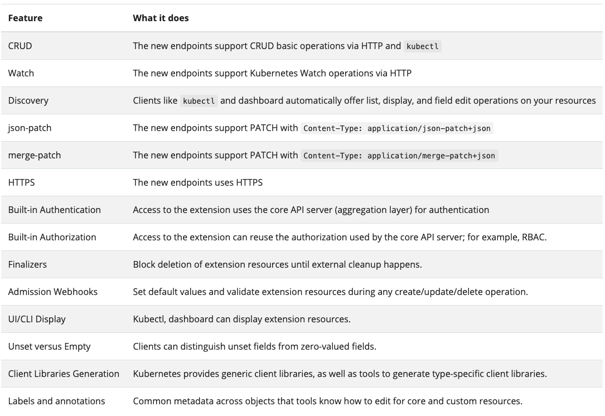
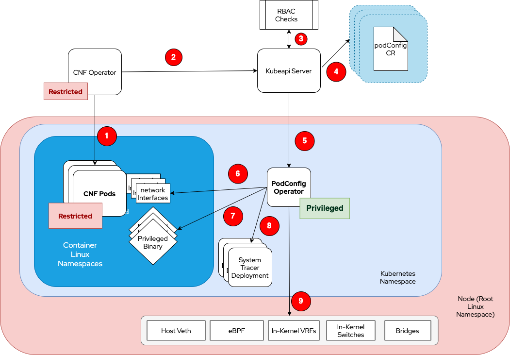
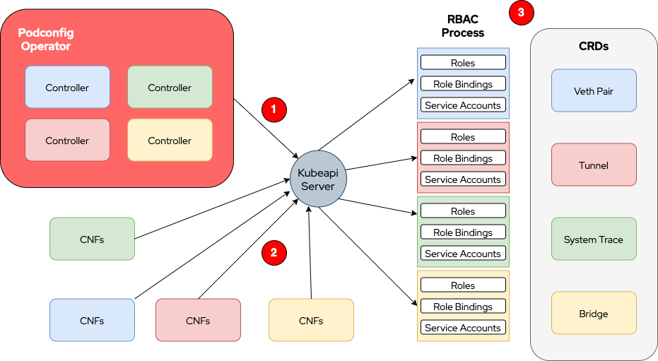
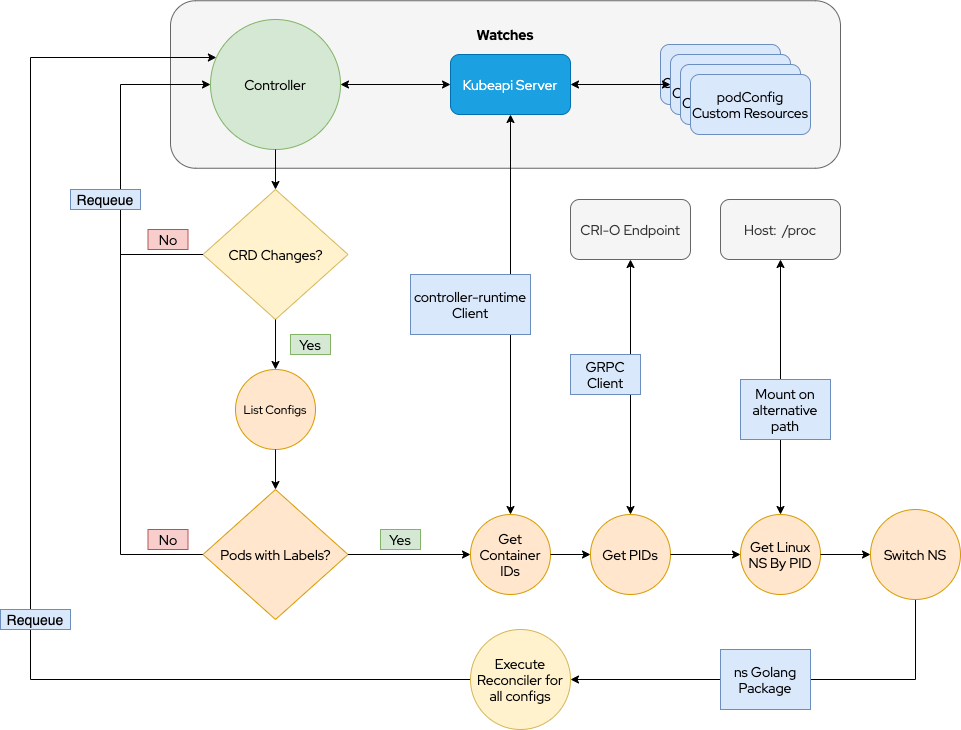

# Design Proposal

### Scope and Motivation

#### Scope:

1. ***What this operator is not:***

This operator is <b>NOT</b> intended to configure anything cluster wide that affects all pods or an entire node behavior with that intent. Those tasks are already performed by a set of operators such as the ones below:

- `Machine Config Operator` - https://github.com/openshift/machine-config-operator
- `Performance Addons Operator` - https://github.com/openshift-kni/performance-addon-operators
- `Cluster Node Tuning Operator` - https://github.com/openshift/cluster-node-tuning-operator
- `Special Resource Operator` - https://github.com/openshift-psap/special-resource-operator
- `Node Feature Discovery Operator` - https://github.com/openshift/cluster-nfd-operator

This operator is <b>NOT</b> intended to replace or configure in any way the traditional CNI installation/configuration (OVN or OpenShift SDN for OpenShift Clusters) made through the cluster network operator:

- `Cluster Network Operator` - https://github.com/openshift/cluster-network-operator

This operator is <b>NOT</b> intended to own specific application deployments, daemonsets, statefulsets or any other application workloads that may result on pods or replicas. It <b>SHOULD</b> own only the configurations it provides gracefully terminating them when a Pod terminates, when the identifying label is deleted or when an entire or partial podConfig object is deleted.

2. ***What it aims to implement:***

This operator is intended to provide an interface for dynamic, runtime custom configurations for specific Pods and/or containers running on a Kubernetes namespace as unprivileged workloads mostly on hard multi-tenant environments. 

Some of the domains that it can reach are lower layers on Linux TPC/IP networking stack for custom network services (a.k.a. CNFs), short running privileged scripts or binaries, long running processes for tracing and packet analysis, Linux special capability configurations among other possible runtime configurations not provided by the Kubernetes or OpenShift Platforms.

It may be used as means of automation to ease up some hard to do configurations even if the application owner has privileges and is running on its own cluster.

It may and will certainly perform configurations on the node on behalf of those specific Pods and/or Containers but carefully considering not to overlap with any of the operators already presented on the above section.

If some interaction between operators is needed it will be done so. But not with overlapping, rather with requests or patching other operators CRDs if it makes sense.

In summary it's a high privileged but trusted workload running as a typical Kubernetes controller performing Linux configurations on behalf of a Pod/Container or a set of Pods constrained to a specific Kubernetes Namespace. Ideally, if multiple namespaces are involved each one should have its own copy of the podconfig operator with specific sets of RBAC controls (roles, rolebindings and service accounts) for each one of them.

#### Motivation: Possible Use Cases

The big motivation here is being able to perform highly privileged configurations on behalf of unprivileged pods. That can only be performed by a trusted workload. The proposal is basically to delegate that duty to an operator that can put together both logic and security mechanisms to protect the areas or domains that are being configured.

Here below we have a list of possible use cases:

1. Custom Networking configured dynamically on demand (extra veth, vlans, vxlans, tunneling, special data planes connectivity, micro-segmentation etc.) Yes. Multus can configure extra networks to some extent but at container creation time. For those that need network configuration during runtime in a dynamic way, on demand, there seems to be no such solution out there.

2. Long Running Processes for: Tracing system calls, eBPF tracing, packet analysis etc. Those type of tasks, even if we have the privileges are pretty hard to setup. If we know how to do so the privileges are pretty high for most of them. They may be used for process analysis in development, auditing low level behaviors, network performance, intrusion detection and much more. Some solutions are already available for those like the iovisor project. It can be a great combination with this operator if we can deploy that kind of tooling without privileges in a secure way and without the burden of configuring everything in separate. Instead they can be another CRD.

3. Linux ambient capabilities or file capabilities needed for specific workloads (Ex: IPC_LOCK) For some environments some Linux Capabilities are harmless but to make them work for containers the UID on the container must be root if we're running them on kubernetes or OCP. To use those capabilities with a non-root user it's necessary to setup ambient capabilities or use file capabilities. With some helper code we can use the libcap2 library we can tweak those capabilities on processes and files. That may be a field to be explored.

4. Temporary "supervised" short run privileged scripts or capability enabled binaries. Let's say that we have an initialization script that was pre-approved, or some clean up code that needs elevated privileges that may be run at certain times. That can be a type of privileged Job that runs an already analysed and approved binary on behalf of the unprivileged pod basically reducing the attack surface.

Other use cases may come up with time.

### Security Concerns on Multi-Tenant Environments

#### Considerations on Trusted vs Untrusted

Why shouldn't we attempt to secure containers with root user? Here goes my 2 cents on it quoting LXC:

"LXC upstream's position is that those containers aren't and cannot be root-safe.

They are still valuable in an environment where you are running trusted workloads or where no untrusted task is running as root in the container.

We are aware of a number of exploits which will let you escape such containers and get full root privileges on the host. Some of those exploits can be trivially blocked and so we do update our different policies once made aware of them. Some others aren't blockable as they would require blocking so many core features that the average container would become completely unusable."

From: https://linuxcontainers.org/lxc/security/

In conclusion, in a multi-tenant environment tenants should run as restricted as possible. In other words unprivileged containers.

#### Linux User Namespaces considerations

Although Linux User Namespaces may allow the root user (uid=0) in a container to be non-root or, even better, a non-existent user on the host root namespace and, therefore, granting extra capabilities inside the container it won't be able to make host/worker node configurations when required. So we still have a lack of permissions for unprivileged workloads when they need.

Some of those requirements may be fulfilled by the operators mentioned in the beginning of this article. Other Pod specific requirements may not be in their scope to perform. There comes the podconfig-operator.

### Non Cloud Native Solutions

#### Changes on:

- kubelet
- CNI api
- Linux Kernel

All the three above could implement some of those features in different ways. The already generally available APIs for all three are pretty conservative about making breaking changes. Specially the Linux Kernel. Without going deep on what could change on them in order to accomplish some of those tasks we can say that even if we do change something on them some other use cases won't fit their scope.

Beyond that the timeline to get an important change to be released as generally available may take a long path to get there.

#### Creation of non-k8s-aware services that can configure the node:

OpenShift nodes are managed by Kubernetes operators. The operators take care of multiple disciplines on OCP nodes. That means that all those configurations are repeatable, reconcilable and visible in a cloud native way via the Kubernetes API extensions.

Any architecture that doesn't comply with that standard will have a hard time adapting to OCP's premisses. Normally it won't be seen as a cloud native/container native way of managing the platform and will most probably bring a lot more work with it since it doesn't inherit all the already proven goods that come from the Kubernetes API itself.

Here below I put an extract with common features that we gain from using CRDs within kubernetes when we develop using the operator pattern.

</img>
Extracted from https://kubernetes.io/docs/concepts/extend-kubernetes/api-extension/custom-resources/.

Beyond all those good features from the extending the kubernetes API we still have the advantage of using the Operator Framework that will give us right away an embedded metrics endpoint to expose the metrics retrieved by the reconciler process as well as all the tooling to seamlessly publish this operator using OLM (Operator Lifecycle Manager) that is already native in OpenShift.

### Architecture Design Proposal

#### Overview:

</img>

1. A CNF operator spins up pods to run CNF application;

2. The CNF requires high privileged Pod configurations on demand from the Kubeapi-server using the podConfig CRD;

3. An admission process will take place and both authentication and authorization will be checked before granting any access to the podConfig CRD;

4. After authorizing, the kubeapi-server allows access to the podConfig;

5. Any changes, creation or deletion of podConfigs will be watched and received by the podConfig operator triggering the reconciler;

6. It may configure special custom network services, interfaces or protocols inside the Pods making available new devices at runtime and on demand;

7. It may run temporary privileged pre-approved commands, binaries or scripts on behalf of the Pod with the proper permissions;

8. If a binary must be run as a long run process such as an strace command that can be run from a special owned deployment with that end;

9. In order to have access to finish some configurations and also connect both ends of a network connection the podconfig-operator will have access on the host to do what is needed constrained within the right scope.

#### Fine Grain Permission Control

</img>

At this point we have only the podConfig CRD that holds the logic for all configurations. As we add new configuration types we may create multiple pairs CRD/Controllers bootstrapped by the same operator in order to profit from the OpenShift RBAC system that already works greatly.

1. The podconfig operator will hold multiple controllers and have access to all CRDs;
2. The CNF tenant will have only the permissions needed for the configuration subset it requires;
3. Each CRD as an API endpoint can be used as any other kubernetes object. They can be referenced in roles with the well known rules and verbs, combined with the proper role bindings having the proper service accounts as subjects.

The only caveat here is from the management perspective. A new CRD may be created to track down all the information from all the separate pieces of configuration into a single object for visibility and administration. 

#### The Controller Workflow

</img>

The controller workflow represented in the diagram above shows a simplified step by step on how the reconciliation process occur. A few steps before actually running the configuration functions its necessary to find out what pods need new configurations, grab the first container ID from the Pod resource object and pass it as a parameter with a ContainerStatusRequest to CRI-O. From the ContainerStatusResponse we can get the process ID for that container. It's the same process that `crictl inspect` does.

> Here we have an important observation. If the configuration is to be available to a Pod (a.k.a. shared linux namespaces between containers) then the first container ID is fine. If it's container or even process specific (for application with more than one process "inside" a container) then the procedure is a little bit more complex than the one represented on the diagram above.

After that we can read the correct path `/proc/<PID>/ns/<desired namespace>` that has a symbolic link with the namespace type and inode for the namespace we want to jump in from the operator. Then we use the ns package from github.com/containernetworking/plugins. Within the proper namespace all changes will affect the desired container.

When it comes to the host it's the same process. We move to PID number 1 and the desired namespace and that's all.

For the reconciler function itself it will depend on the logic and configurations that we're trying to achieve. Each different configuration object may require different libraries to perform the configurations.

#### Accounting for IP Address Space Management Collisions

One operator that is key to this project is the OpenShift Cluster Network Operator. It needs to be watched all times for the Cluster and Pod network CIDRs and never overlap the extra IPs allocated for extra networks with the ones provided by the cluster. In some situations this could work fine as long as the routing domains don't clash and the networks never talk with each other or if some sort of NAT is being performed in the path. But the highlight is that we need to be aware that a collision or overlap may have pretty bad side effects on the normal cluster operation and the information that prevents that is provided by the Network Operator.

### Conclusion

We hope with this design cover the lack of attention that very special applications in the Telecom and Edge computing domain may require for their next generation containerized cloud native initiatives.